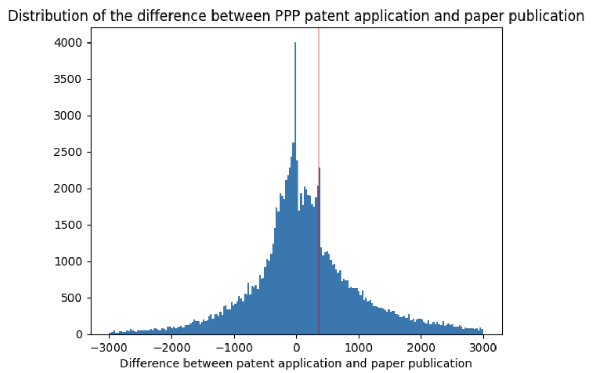

# Patent-paper-pair (PPP) dataset

This repository provides the code to generate the first public-use set of patent paper pairs (PPPs) from 1976 to 2023, limited to patents granted by the USPTO and but considering  all scientific articles. Our dataset includes approximately 500,000 PPPs, categorized by confidence score and validated in three ways. Our PPP dataset is available at http://relianceonscience.org. You can refer to our paper "Does Patenting Promote the Progress of Science?" for more details: https://assets.zyrosite.com/YZ97xEPgM7SegrpN/ppp20240531-m5KvaGBojMIza35N.pdf. 

This github repository provides the code to generate the PPP dataset, the figures and the data used in the regressions describe in the paper. 

The order in which the codes should be run is the following: 
1. predictive_model
2. PPP_identification
3. PPP_analysis

Note that these codes require OpenAlex and PatentsView databases to be downloaded and stored onto a local PostgreSQL database. It also requires the papers' and patents' titles and abstracts to be encoded with a pre-trained LLM and stored onto a local PostgreSQL database. The steps to download OpenAlex and PatentsView data and encode the papers' and patents' titles and abstracts, as well as the database structure are described in detail in the folders "download_OpenAlex", "download_PatentsView" and "text_encoding" in this github: https://github.com/EmmaScharfmann/scientists-inventors

* The folder "predictive_model" provides the code to create the training set using self-plagiarism, train and validate the classification model to identify the PPPs.
* The folder "PPP_identification" provides the code to identify two types of PPPs: the citation based PPPs and the scientist-inventor based PPPs.
* The folder "PPP_analysis" provides the code to link each PPP with a control paper ("similar paper"), and to create the two files used to run the regressions (count of citations and count of future similar papers).

Below, the difference (in days) between the PPP paper publication date and the PPP application date of the patent (first application of the patent family) for citation based PPPs. 

