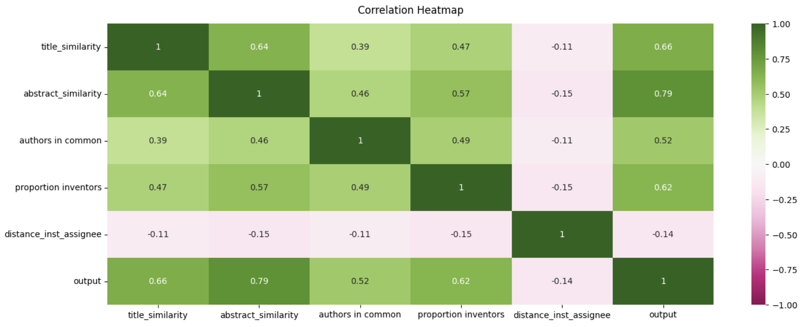

# This folder describes how to train the classification model to identify the PPPs. 

Here, we provide the code to create the training set using self-plagiarism, as well as the code to train, validate and save the classification model (random forest). 

This section requires the full data (OpenAlex + PatentsView) to be loaded into a Postgres database (username and password are required to run the codes, please see folders download_OpenAlex and download_PatentsView from https://github.com/EmmaScharfmann/scientists-inventors). It also requires the patent and paper titles and abstracted to be encoded with a pre-trained model (please see folder text_encoding https://github.com/EmmaScharfmann/scientists-inventors). 

* the notebook "training_set_and_model.ipynb" provides the code for the whole training process. The first section "Generating training set" provides the code to query and identify around 4K examples of PPPs using self plagiarism. The second section provides the code to train, evaluate and save the random forest, using the training set created in the previous sections. This section also provides the code to generate the figures stored in the folder predictive_model/figures. The last section provides code to evaluate the random forest using a set of manually classified PPPs mag_patent_ppp_Henry.csv. 
* the figures can be found and downloaded into the folder "figures"

Below, the correlation matrix of the features used in the random forest: 

